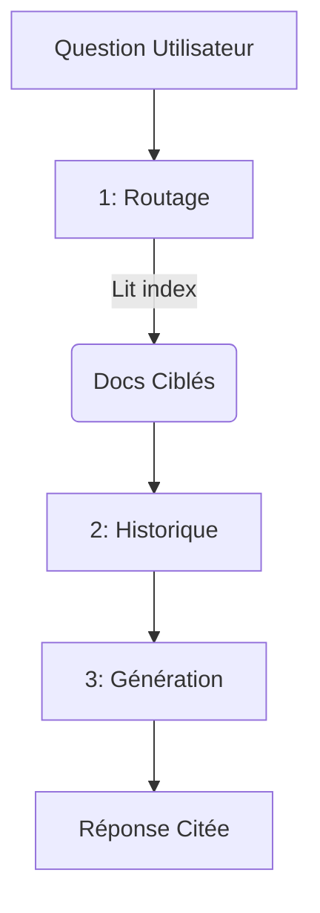

# NoRag v2
Le RAG du Futur : Système Documentaire à 3 Index par Routage LLM

  
    Commencer la présentation <carbon:arrow-right class="inline"/>
  

---
transition: fade-out
---

# 🛑 Le Problème du RAG Classique

Pourquoi l'approche vectorielle traditionnelle montre ses limites ?

<v-click>

- **Boîte Noire Vectorielle** : Découpage du texte en embeddings (vecteurs) incompréhensibles par l'humain.
- **Perte du Contexte Global** : La recherche de similarité trouve des phrases isolées, perdant l'intention globale de l'auteur.
- **Complexité de l'Infrastructure** : Nécessite des bases de données vectorielles spécialisées lourdes (pgvector, Pinecone).

</v-click>

 
<v-click>

💡 _« Et si on laissait l'IA lire l'index complet comme un humain, plutôt que de manipuler des vecteurs ? »_

</v-click>

---
transition: slide-up
layout: image-right
image: https://images.unsplash.com/photo-1555949963-ff9fe0c870eb?q=80&w=2070&auto=format&fit=crop
---

# 🚀 La Solution NoRag

Un routage **100% LLM** qui exploite les **immenses fenêtres de contexte dynamiques** d'aujourd'hui.

- **Transparence Totale** : Index en pur Markdown lisible par un humain.
- **Zéro Vecteur** : Recherche sémantique réelle par compréhension de lecture.
- **Infrastructure Minimaliste** : Supporte SQLite, Supabase, ou fichiers locaux.
- **Multi-LLM As A Feature** : Compatible (Gemini, ChatGPT, Claude, Grok...).

---
layout: default
---

# 🧠 L'Ère des Fenêtres de Contexte Géantes

Pourquoi NoRag v2 est possible **aujourd'hui** (Fin 2024 / 2025) :

<v-clicks>

- **Google Gemini (1.5 / 2.5)** : **1 à 2 Millions** de tokens (soit ~1500 à 3000 pages).
- **xAI Grok (Grok 3 / 4.1)** : Jusqu'à **2 Millions** de tokens.
- **Anthropic Claude (3.5 / MAX)** : **200K à 1 Million** de tokens.
- **OpenAI GPT-4o / o1** : **128K** tokens (soit ~300 pages).
- **Mistral Large 2** : **128K** tokens.

</v-clicks>

 
<v-click>

> **La Révolution** : L'IA peut littéralement mémoriser l'intégralité de vos index documentaires **à chaque question**, rendant obsolète le découpage empirique du RAG vectoriel.

</v-click>

---
layout: default
---

# 🏗️ Architecture en 3 Index

Au cœur de NoRag se trouvent 3 fichiers Markdown (dans le dossier `data/`) :

<v-clicks>

1. 🤖 **`index_agents.md`**
   - Le catalogue des *Agents/Skills*. L'IA sait quelles compétences elle peut appeler.
2. 📚 **`index_documents.md`** 
   - Le "Cerveau" de routage. Il liste tous les documents avec leur résumé et leurs chapitres.
3. 📜 **`index_history.md`**
   - Résumé perpétuel des conversations. Permet à n'importe quel LLM de reprendre le fil.

</v-clicks>

---
layout: two-cols
---

# ⚙️ Le Pipeline en 3 Étapes

Le workflow strict imposé au LLM.

<v-clicks>

1. 🗺️ **ROUTAGE (Silencieux)**
   - L'IA lit `index_documents.md` et cible 1 à 3 documents pertinents.

2. 🗃️ **COMPRÉHENSION**
   - L'historique (`index_history.md`) est lu pour s'adapter à la session.

3. ✍️ **GÉNÉRATION & CITATION**
   - L'IA lit uniquement le PDF ciblé et génère sa réponse.
   - **Règle absolue** : Citation obligatoire au format `[Document, Pages X-Y]`.

</v-clicks>

::right::

---
layout: default
---

# 🎛️ 4 Modes d'Utilisation (Flexibilité Totale)

NoRag s'adapte du prompt unique jusqu'à la production cloud.

- **Mode A (Sans Code / Plugin Agent)** 🧩
  - Copiez un plugin (`norag/plugins/*`) dans ChatGPT, Claude ou Grok. Ajoutez les 3 index Markdown.
- **Mode B (CLI Local & Interactif)** 💻
  - `python -m api.local_query` : Terminal avec mémorisation dans SQLite locale.
- **Mode C (Serveur API Local - SQLite)** 🔌
  - Un serveur backend FastAPI (`uvicorn api.main:app`), base locale.
- **Mode D (Serveur API Cloud - Supabase)** ☁️
  - Variable `NORAG_BACKEND=supabase` : Prêt pour Vercel/VPS.

---
layout: statement
---

# Zéro Hallucination.
# Transparence Absolue.
# Full LLM Routing.

### Bienvenue dans le RAG v2 avec NoRag.

---
layout: center
class: text-center
---

# Merci
Lancez l'API pour démarrer : `uvicorn api.main:app`

  Présentation générée par Antigravity / Sli.dev

