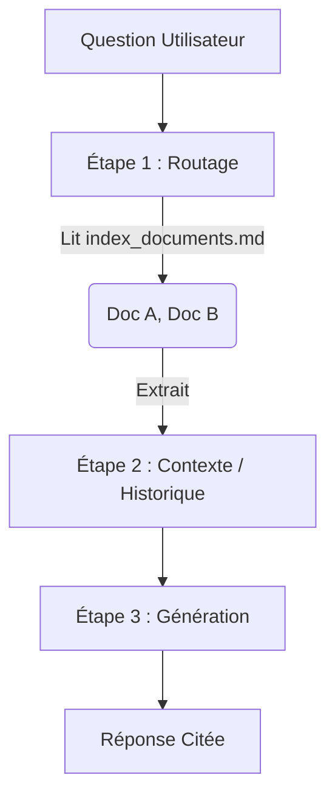

# NoRag v2
Le RAG du Futur : Système Documentaire à 3 Index par Routage LLM

  
    Commencer la présentation <carbon:arrow-right class="inline"/>
  

---
transition: fade-out
---

# 🛑 Le Problème du RAG Classique

Pourquoi l'approche traditionnelle vectorielle montre ses limites ?

<v-click>

- **Boîte Noire Vectorielle** : Découpage du texte en embeddings (vecteurs) incompréhensibles par l'humain.
- **Perte du Contexte Global** : La recherche de similarité (cosine similarity) trouve des morceaux de phrases isolés, perdant l'intention globale de l'auteur.
- **Complexité de l'Infrastructure** : Nécessite des bases de données vectorielles spécialisées lourdes (pgvector, Pinecone, FAISS, Milvus).

</v-click>

 
<v-click>

💡 _« Et si on laissait l'IA lire l'index complet comme un humain, plutôt que de manipuler des vecteurs ? »_

</v-click>

---
transition: slide-up
layout: image-right
image: https://images.unsplash.com/photo-1555949963-ff9fe0c870eb?q=80&w=2070&auto=format&fit=crop
---

# 🚀 La Solution NoRag

Un routage **100% LLM** qui exploite les immenses fenêtres de contexte dynamiques d'aujourd'hui (1M+ tokens pour Gemini 1.5, 200K pour Claude 3.5).

- **Transparence Totale** : Index en pur Markdown lisible par un humain.
- **Zéro Vecteur** : Recherche sémantique réelle par compréhension de lecture, pas par mathématiques.
- **Infrastructure Minimaliste** : Supporte SQLite (local), Supabase (cloud), ou même sans base de données du tout (fichiers locaux).
- **Multi-LLM As A Feature** : Compatible (Gemini, ChatGPT, Claude, Grok, Local LLMs).

---
layout: default
---

# 🏗️ Architecture en 3 Index

Au cœur de NoRag se trouvent 3 fichiers Markdown (dans le dossier `data/`) :

<v-clicks>

1. 🤖 **`index_agents.md`**
   - Le catalogue des *Agents/Skills* (ex: L'agent Documentaire, L'Archiviste). L'IA sait quelles compétences elle peut appeler.
2. 📚 **`index_documents.md`** 
   - Le "Cerveau" de routage. Il liste tous les documents avec leur résumé et leurs chapitres (titres + mots-clés).
3. 📜 **`index_history.md`**
   - Résumé perpétuel des conversations. Permet à n'importe quel LLM nouveau de reprendre le fil d'une session précédente.

</v-clicks>

---
layout: two-cols
---

# ⚙️ Le Pipeline en 3 Étapes

Le workflow strict que le système impose au LLM pour ne jamais halluciner :

<v-clicks>

1. 🗺️ **ROUTAGE (Silencieux)**
   - L'IA lit l'index documentaire et la question. 
   - Elle identifie *réellement* quels sont les 1 à 3 documents/pages pertinents (ex: `pages 20-35 du Document A`).

2. 🗃️ **COMPRÉHENSION CONTEXTUELLE**
   - L'historique compacté (`index_history.md`) est lu pour s'adapter à la demande, en identifiant s'il s'agit d'un suivi de question.

3. ✍️ **GÉNÉRATION & CITATION**
   - L'IA lit uniquement le texte cible ciblé et génère sa réponse.
   - **Règle absolue** : Citation obligatoire au format `[Document, Pages X-Y]`.

</v-clicks>

::right::

    

---
layout: default
---

# 🎛️ 4 Modes d'Utilisation (Flexibilité Totale)

NoRag a été conçu pour s'adapter du prompt unique jusqu'à la production cloud.

- **Mode A (Sans Code / Plugin Agent)** 🧩
  - Copiez un des plugins (`norag/plugins/*`) dans les instructions de ChatGPT, Claude, Grok ou Antigravity. Ajoutez les 3 index Markdown. Et voilà.
- **Mode B (CLI Local & Interactif)** 💻
  - `python -m api.local_query` : Un terminal direct avec mémorisation dans SQLite locale. Rapide et autonome.
- **Mode C (Serveur API Local - SQLite)** 🔌
  - Un serveur backend FastAPI (`uvicorn api.main:app`), stockant tout en base locale pour créer votre propre interface web.
- **Mode D (Serveur API Cloud - Supabase)** ☁️
  - Variable `NORAG_BACKEND=supabase` : Se connecte instantanément à PostgreSQL/Supabase. Prêt pour Vercel/VPS.

---
layout: statement
---

# Zéro Hallucination, 
# Transparence Absolue,
# Full LLM Routing.

### Bienvenue dans le RAG v2 avec NoRag.
[GitHub / Doc & README](...)

---
layout: center
class: text-center
---

# Merci
Lancez le projet avec : `uvicorn api.main:app`

  Présentation générée par Antigravity / Sli.dev

